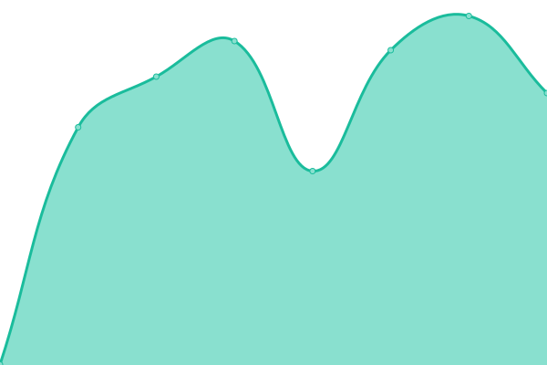
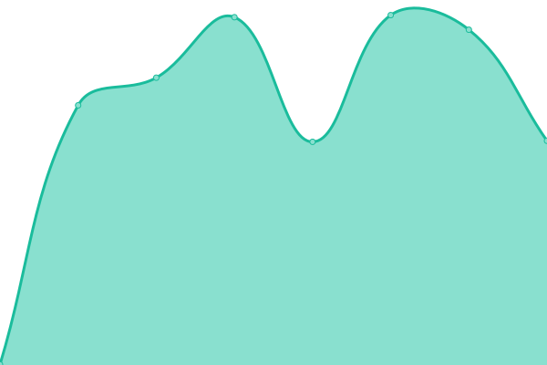

# [📈 Live Status](https://demo.upptime.js.org): <!--live status--> **🟩 All systems operational**

This repository contains the open-source uptime monitor and status page for [adrienwb](https://demo.upptime.js.org), powered by [Upptime](https://github.com/upptime/upptime).

With [Upptime](https://upptime.js.org), you can get your own unlimited and free uptime monitor and status page, powered entirely by a GitHub repository. We use [Issues](https://github.com/adrienwb/upptime/issues) as incident reports, [Actions](https://github.com/adrienwb/upptime/actions) as uptime monitors, and [Pages](https://demo.upptime.js.org) for the status page.

<!--start: status pages-->
<!-- This summary is generated by Upptime (https://github.com/upptime/upptime) -->
<!-- Do not edit this manually, your changes will be overwritten -->
<!-- prettier-ignore -->
| URL | Status | History | Response Time | Uptime |
| --- | ------ | ------- | ------------- | ------ |
|  [R3 Portal](https://portal.r3-group.app) | 🟩 Up | [r3-portal.yml](https://github.com/R3Group-Digital/upptime/commits/HEAD/history/r3-portal.yml) | 

 652ms
     
 | 

<a href="https://status.r3-group.app/history/r3-portal">100.00%</a>
    

|  [R3 Access Management (SSO)](https://sso.r3-group.app/) | 🟩 Up | [r3-access-management-sso.yml](https://github.com/R3Group-Digital/upptime/commits/HEAD/history/r3-access-management-sso.yml) | 

 635ms
     
 | 

<a href="https://status.r3-group.app/history/r3-access-management-sso">100.00%</a>
    

|  [R3 Design System](https://design.r3-group.app/) | 🟩 Up | [r3-design-system.yml](https://github.com/R3Group-Digital/upptime/commits/HEAD/history/r3-design-system.yml) | 

 604ms
     
 | 

<a href="https://status.r3-group.app/history/r3-design-system">100.00%</a>
    

|  [R3 Pilot RSE (Tembo Tool)](https://app.tembo-tool.io/) | 🟩 Up | [r3-pilot-rse-tembo-tool.yml](https://github.com/R3Group-Digital/upptime/commits/HEAD/history/r3-pilot-rse-tembo-tool.yml) | 

 384ms
     
 | 

<a href="https://status.r3-group.app/history/r3-pilot-rse-tembo-tool">100.00%</a>
    

|  [R3 Pilot Carbone (Climatip)](https://r3-carbone.climatip.fr/) | 🟩 Up | [r3-pilot-carbone-climatip.yml](https://github.com/R3Group-Digital/upptime/commits/HEAD/history/r3-pilot-carbone-climatip.yml) | 

 559ms
     
 | 

<a href="https://status.r3-group.app/history/r3-pilot-carbone-climatip">100.00%</a>
    

|  [Diag RSE](https://diag-rse.r3-group.app/) | 🟩 Up | [diag-rse.yml](https://github.com/R3Group-Digital/upptime/commits/HEAD/history/diag-rse.yml) | 

 604ms
     
 | 

<a href="https://status.r3-group.app/history/diag-rse">100.00%</a>
    

<!--end: status pages-->

[**Visit our status website →**](https://demo.upptime.js.org)

## 📄 License

- Powered by: [Upptime](https://github.com/upptime/upptime)
- Code: [MIT](./LICENSE) © [Anand Chowdhary](https://anandchowdhary.com), supported by [Pabio](https://pabio.com)
- Data in the `./history` directory: [Open Database License](https://opendatacommons.org/licenses/odbl/1-0/)
